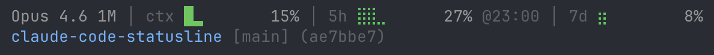
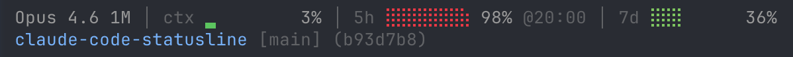

# claude-code-statusline

[Claude Code](https://claude.ai/code) 用のカスタムステータスライン。モデル情報、リソース使用状況、git コンテキストを表示します。

## 表示例



レートリミット接近時 (リセット時刻を表示):



**上段** — モデル名、コンテキストウィンドウサイズ、使用率バー:
- コンテキストウィンドウ: ブロック文字 `▁▂▃▄▅▆▇█`
- レートリミット (5h / 7d): ブレイユ文字 `⡀⣀⣄⣤⣦⣶⣷⣿`
- 色グラデーション: 緑 (低) → 黄 → 赤 (高)
- レートリミットの色は使用ペースに基づく予測値で決定 (リミット到達見込み時にはリセット時刻を表示)

**下段** — Git 対応のディレクトリ表示:
- リポジトリ名 + 相対パス
- ブランチ名とコミットハッシュ
- git 管理外ではディレクトリパスをそのまま表示

## インストール

```bash
# 1. スクリプトをダウンロード
curl -Lo ~/.claude/statusline.py https://github.com/ta17eee/claude-code-statusline/releases/latest/download/statusline.py

# 2. Claude Code の設定ファイル (~/.claude/settings.json) に以下を追加
```

```json
{
  "statusLine": {
    "type": "command",
    "command": "python3 ~/.claude/statusline.py"
  }
}
```

## 必要環境

- **Claude Code**
- **Python 3.7+** — 標準ライブラリのみ使用 (`pip install` 不要)
  - macOS: Xcode Command Line Tools でプリインストール済み
  - Linux: ほとんどのディストリビューションでプリインストール済み
  - Windows: [手動インストール](https://www.python.org/downloads/)が必要
- **Git** (任意) — 下段のブランチ/コミット表示に使用。未インストールの場合はディレクトリパスのみ表示
- **ターミナル** — 24-bit カラーと Unicode 対応が必要 (Ghostty, iTerm2, Alacritty, Kitty, Windows Terminal, cmux 等)

## 特徴

- **コンテキストウィンドウバー** — ブロック文字 (`▁▂▃▄▅▆▇█`) による9段階表示
- **レートリミットバー** — ブレイユ文字 (`⡀⣀⣄⣤⣦⣶⣷⣿`) による9段階表示
- **ペース予測カラー** — レートリミットの色は使用ペースの線形予測に基づき、ウィンドウ終盤ほど敏感に反応。到達見込み時にはリセット時刻 (`@HH:MM`) を表示
- **コンパクトなモデル情報** — display name から冗長な表記を除去し、実データからサイズ表示 (`1M`, `200K`)
- **Git worktree 対応** — worktree 間の移動でも正しいパスを表示
- **軽量** — git 呼び出しは3回 (`rev-parse` ×2 + `branch`) のみ、キャッシュ不要

## 更新

同じコマンドを再実行してください:

```bash
curl -Lo ~/.claude/statusline.py https://github.com/ta17eee/claude-code-statusline/releases/latest/download/statusline.py
```

現在のバージョンは `python3 ~/.claude/statusline.py --version` で確認できます。

## 補足

- レートリミットバー (5h / 7d) は Claude.ai サブスクライバーのみ表示されます
- ステータスラインはアシスタントのメッセージ出力後に更新されます (300ms デバウンス)
- Windows では UTF-8 出力エンコーディングが自動設定されます

---

## English

A custom status line for [Claude Code](https://claude.ai/code) displaying model info, resource usage, and git context.

### Install

```bash
curl -Lo ~/.claude/statusline.py https://github.com/ta17eee/claude-code-statusline/releases/latest/download/statusline.py
```

Add to `~/.claude/settings.json`:

```json
{
  "statusLine": {
    "type": "command",
    "command": "python3 ~/.claude/statusline.py"
  }
}
```

### Requirements

- **Claude Code**
- **Python 3.7+** — standard library only, no `pip install` needed
- **Git** (optional) — for branch/commit display; falls back to plain directory path
- **Terminal** — 24-bit color and Unicode support required (Ghostty, iTerm2, Alacritty, Kitty, Windows Terminal, cmux, etc.)

## License

[MIT](LICENSE)
