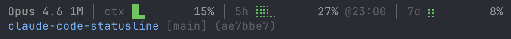
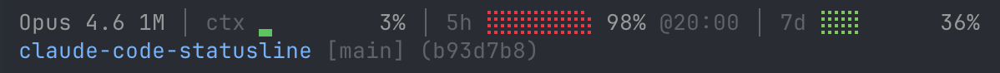

# claude-code-statusline

[Claude Code](https://claude.ai/code) 用のカスタムステータスライン。モデル情報、リソース使用状況、git コンテキストを表示します。

## 表示例



レートリミット接近時:



**上段** — モデル名、effort レベル、使用率バー:
- コンテキストウィンドウ: ブロック文字 `▁▂▃▄▅▆▇█`
- レートリミット (5h / 7d): ブレイユ文字 `⡀⣀⣄⣤⣦⣶⣷⣿`
- 色グラデーション: 緑 (低) → 黄 → 赤 (高)
- レートリミットの色は使用ペースに基づく予測値で決定
- 5h はリセット時刻を常に表示、7d はリミット到達見込み時に表示

**下段** — Git 対応のディレクトリ表示:
- リポジトリ名 + 相対パス
- ブランチ名とコミットハッシュ
- git 管理外ではディレクトリパスをそのまま表示

## インストール

macOS / Linux:

```bash
curl -fsSL https://github.com/ta17eee/claude-code-statusline/releases/latest/download/install.sh | sh
```

Windows (PowerShell):

```powershell
irm https://github.com/ta17eee/claude-code-statusline/releases/latest/download/install.ps1 | iex
```

インストール後、表示されるパスを Claude Code の設定ファイル (`~/.claude/settings.json`) に追加してください:

```json
{
  "statusLine": {
    "type": "command",
    "command": "/path/to/.claude/statusline"
  },
  "subagentStatusLine": {
    "type": "command",
    "command": "/path/to/.claude/statusline --subagent"
  }
}
```

`subagentStatusLine` は任意です。設定すると、エージェントパネル (プロンプト入力欄下のタスク一覧) の行にモデル名が追加されます。

<details>
<summary>旧 Python 版 (v1.2.1 以前) を使い続ける場合</summary>

```bash
curl -Lo ~/.claude/statusline.py https://github.com/ta17eee/claude-code-statusline/releases/download/v1.2.1/statusline.py
```

```json
{
  "statusLine": {
    "type": "command",
    "command": "python3 ~/.claude/statusline.py"
  }
}
```

Python 版は機能追加を終了し、Rust 版に一本化されます。
</details>

## 必要環境

- **Claude Code**
- **Git** (任意) — 下段のブランチ/コミット表示に使用。未インストールの場合はディレクトリパスのみ表示
- **ターミナル** — 24-bit カラーと Unicode 対応が必要 (Ghostty, iTerm2, Alacritty, Kitty, Windows Terminal, cmux 等)

Python や追加ランタイムのインストールは不要です (単一のネイティブバイナリ)。対応プラットフォーム: macOS (Apple Silicon / Intel)、Linux (x86_64)、Windows (x86_64)。

## 特徴

- **コンテキストウィンドウバー** — ブロック文字 (`▁▂▃▄▅▆▇█`) による9段階表示
- **レートリミットバー** — ブレイユ文字 (`⡀⣀⣄⣤⣦⣶⣷⣿`) による9段階表示
- **ペース予測カラー** — レートリミットの色は使用ペースの線形予測に基づき、予測80%以下は緑を維持し、ウィンドウ終盤ほど色の変化が厳しめに
- **リセット時刻表示** — 5h は常にリセット時刻を表示。7d は到達見込み時に表示し、24時間以上先なら日付 (`@Apr15`)、24時間以内なら時刻 (`@14:30`)
- **クロスセッション共有** — 複数セッション間でレートリミット情報をキャッシュファイル (`~/.claude/statusline-cache.json`) 経由で共有。他セッションの最新値が反映される
- **コンパクトなモデル情報** — display name から冗長な表記を除去
- **effort レベル表示** — reasoning effort (`low`〜`max`) をモデル名の隣に表示。セッション中の `/effort` 変更も反映。非対応モデルでは非表示
- **Git worktree 対応** — worktree 間の移動でも正しいパスを表示
- **サブエージェント行のモデル表示** (`--subagent`) — エージェントパネルの実行中タスク行に、デフォルト UI では確認できないモデル名を追加。トークン数・経過時間はデフォルトと同じ書式のまま、`↓` はトークン受信中 (直近約5秒で増加) のときだけ点灯。対象は Task ツールのサブエージェント (エージェントチームの teammate 行には現行の Claude Code がデータを渡さないため、デフォルト表示のまま)
- **ネイティブバイナリ** — Rust + gitoxide (`gix`) 実装。git 情報の取得にサブプロセスを起動せず、実行1回あたりのコストは1桁ミリ秒台

## 更新

同じコマンドを再実行してください:

```bash
curl -fsSL https://github.com/ta17eee/claude-code-statusline/releases/latest/download/install.sh | sh
```

現在のバージョンは `~/.claude/statusline --version` で確認できます。

## 補足

- レートリミットバー (5h / 7d) は Claude.ai サブスクライバーのみ表示されます
- ステータスラインはアシスタントのメッセージ出力後に更新されます (300ms デバウンス)
- キャッシュファイル (`~/.claude/statusline-cache.json`) はセッション間で自動的に作成・更新されます

---

## English

A custom status line for [Claude Code](https://claude.ai/code) displaying model info, resource usage, and git context.

### Install

macOS / Linux:

```bash
curl -fsSL https://github.com/ta17eee/claude-code-statusline/releases/latest/download/install.sh | sh
```

Windows (PowerShell):

```powershell
irm https://github.com/ta17eee/claude-code-statusline/releases/latest/download/install.ps1 | iex
```

Add the printed path to `~/.claude/settings.json`:

```json
{
  "statusLine": {
    "type": "command",
    "command": "/path/to/.claude/statusline"
  },
  "subagentStatusLine": {
    "type": "command",
    "command": "/path/to/.claude/statusline --subagent"
  }
}
```

`subagentStatusLine` is optional; it adds the model name to running task rows in the agent panel.

### Requirements

- **Claude Code**
- **Git** (optional) — for branch/commit display; falls back to plain directory path
- **Terminal** — 24-bit color and Unicode support required (Ghostty, iTerm2, Alacritty, Kitty, Windows Terminal, cmux, etc.)

No Python or other runtime required (single native binary). Supported platforms: macOS (Apple Silicon / Intel), Linux (x86_64), Windows (x86_64).

## License

[MIT](LICENSE)
